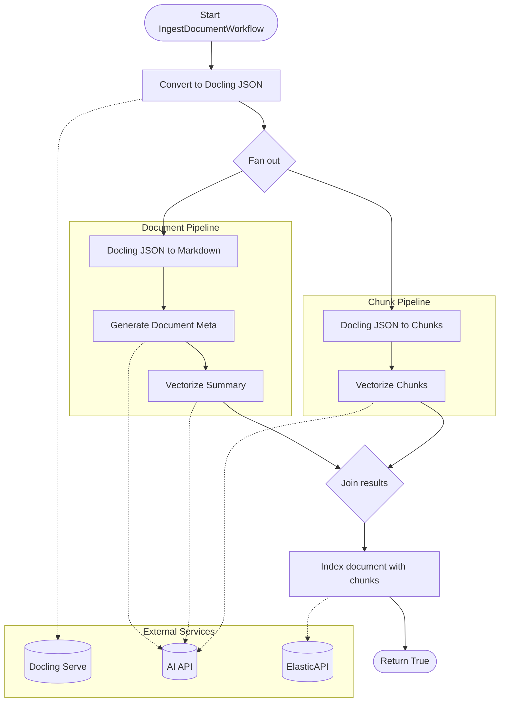

```mermaid
flowchart TB
    subgraph EXT[External Services]
        direction LR
        DOCLING[(Docling Serve)]
        AI[(AI API)]
        ES[(ElasticAPI)]
    end

    START([Start IngestDocumentWorkflow])
    CONVERT[Convert to Docling JSON]
    FANOUT{Fan out}

    START --> CONVERT --> FANOUT

    subgraph DOC[Document Pipeline]
        direction TB
        DOC_1[Docling JSON to Markdown]
        DOC_2[Generate Document Meta]
        DOC_3[Vectorize Summary]

        DOC_1 --> DOC_2 --> DOC_3
    end
    subgraph CHUNK[Chunk Pipeline]
        direction TB
        CHUNK_1[Docling JSON to Chunks]
        CHUNK_2[Vectorize Chunks]

        CHUNK_1 --> CHUNK_2
    end

    JOIN{Join results}
    INDEX[Index document with chunks]
    DONE([Return True])

    JOIN --> INDEX --> DONE

    FANOUT --> DOC_1
    FANOUT --> CHUNK_1

    DOC_3 --> JOIN
    CHUNK_2 --> JOIN

    CONVERT -.-> DOCLING
    DOC_2 -.-> AI
    DOC_3 -.-> AI
    CHUNK_2 -.-> AI
    INDEX -.-> ES
```
